# The Cost Detective Audit

**Scenario:** You have inherited an AWS account from a previous team that was reckless with spending. Your budget is tight. Identify waste, implement governance, and architect a cost-aware solution.

**Account:** `412381768295` · **Region:** `eu-west-1` (Ireland) · **State:** S3 remote backend

---

## Project Structure

A **single Terraform root** composes four child modules behind **one S3 remote backend**. There is one `terraform init` / `terraform apply` for the whole project — Terraform resolves deploy order from the dependency graph.

```
FinOps/
├── backend.tf                    # S3 remote state + native lockfile (no DynamoDB)
├── providers.tf                  # AWS + archive providers, default_tags
├── main.tf                       # composes the four modules
├── variables.tf / outputs.tf     # root inputs & surfaced outputs
├── example.tfvars                # copy to terraform.tfvars
│
├── modules/
│   ├── zombie/                   # Part 1 — wasteful resource simulation
│   ├── cleanup/                  # Part 1 — multi-region garbage-collector Lambda
│   │   └── lambda/garbage_collector.py
│   ├── governance/               # Part 2 — budget, alerts, tagging policy
│   │   └── documentation/policies/{scp-deny-untagged.json, tagging-policy.md}
│   └── optimize/                 # Part 3 — Spot + On-Demand mixed ASG
│       └── documentation/cost-optimization-guide.md
│
├── tests/                        # pytest unit tests for the garbage collector
├── scripts/bootstrap-backend.sh  # creates the S3 state bucket (run once)
├── docs/verification.md          # live CLI verification log
├── .github/workflows/ci.yml      # fmt + validate + pytest on every push/PR
└── Assets/                       # screenshots from the live AWS console
```

---

## Deploy

```bash
export AWS_PROFILE=NSPAccount          # authenticate
./scripts/bootstrap-backend.sh         # create the remote-state bucket (once)
cp example.tfvars terraform.tfvars     # set alert_email
terraform init                         # init against the S3 backend
terraform apply
```

After apply, **confirm the SNS subscription email** AWS sends to `alert_email`, or budget alerts will not be delivered.

### Tear down

```bash
terraform destroy
```

> **Org constraint:** this sandbox sits under an AWS Organizations SCP that denies `config:StopConfigurationRecorder` and `config:DeleteConfigRule`. `terraform destroy` therefore cannot remove `aws_config_configuration_recorder` or the `require-costcenter-tag-ec2` rule — `terraform state rm` those two addresses first, or leave them for an org admin. (This is why those resources survived the first teardown.)

---

## Part 1 — Analysis and Cleanup

### Zombie resources deployed (`modules/zombie`)

Three deliberately wasteful resources, all tagged `Type=ZombieAsset` so the garbage collector is permitted to reap them.

| Resource | Name | Details | Why it wastes money |
|---|---|---|---|
| EC2 Instance | `zombie-idle-ec2` | t3.medium, Amazon Linux 2023 | Running at ~0% CPU — paying for idle compute |
| EBS Volume | `zombie-unattached-ebs` | 10 GiB gp3, `eu-west-1a` | `Available` — not attached to any instance |
| Elastic IP | `zombie-unassociated-eip` | `3.248.75.163` | Not associated — AWS charges for idle EIPs |

#### Idle EC2 instance — running at 0.188% CPU

`zombie-idle-ec2` (`i-0f7b7102562cceeb3`) is **Running** with no workload. The Monitoring panel confirms **CPU utilisation ~0.188%** — textbook idle compute that the previous team kept paying for.

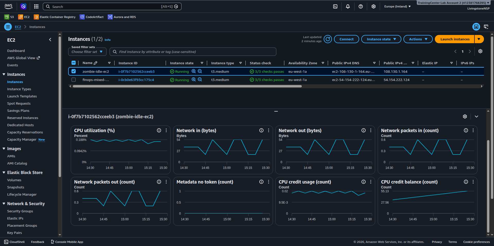

#### Unattached EBS volume

`zombie-unattached-ebs` (`vol-0c670db7689514829`) is 10 GiB gp3 in `eu-west-1a`, **Volume state: Available**, **Attached resources: –** — accumulating storage charges with no workload benefit.

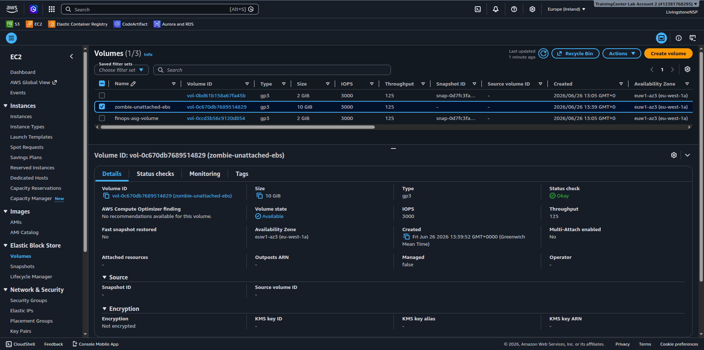

#### Unassociated Elastic IP

`zombie-unassociated-eip` (`3.248.75.163`, allocation `eipalloc-025227580116c454c`) has **no Association ID** and **no Associated instance** — AWS bills idle public IPv4 addresses by the hour.

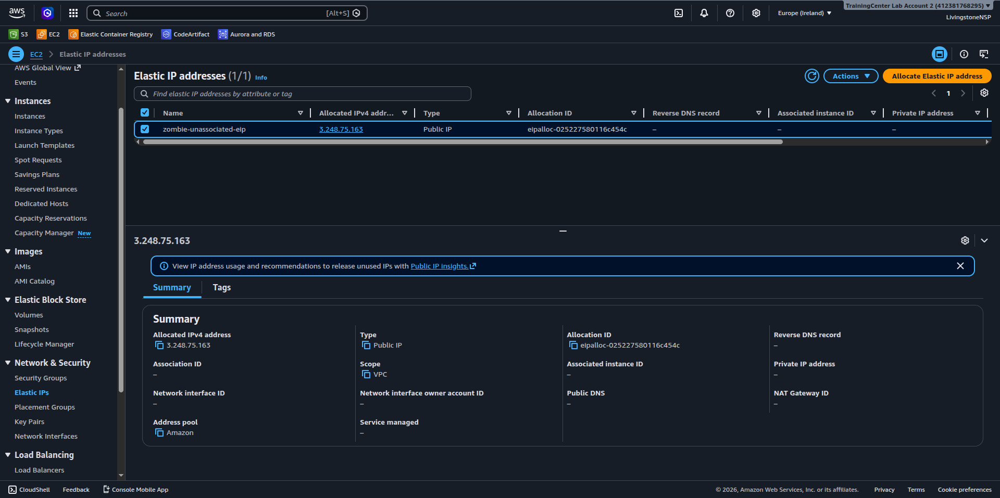

### Cost impact

**Cost Explorer** shows the account's spend for the month driven entirely by these resources plus the optimisation ASG.

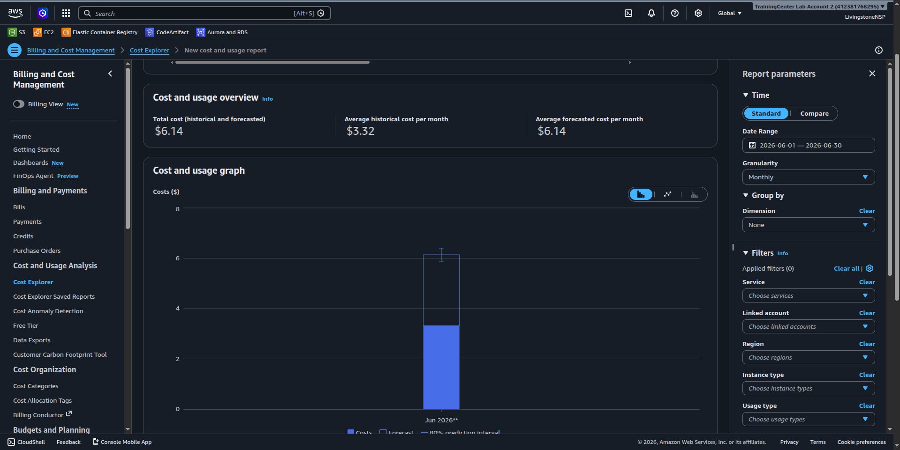

The **Bills** page gives the line-item breakdown and is the most important cost evidence — it shows **both On-Demand and Spot instance-hours**, proving the mixed-instances design is live:

| Line item | Usage | Cost |
|---|---|---|
| On-Demand Linux **t3.medium** | 223.047 hrs | $10.17 |
| On-Demand Linux t3.micro (tag-policy test launch) | 32.928 hrs | $0.38 |
| **Spot** Linux t3.medium (AZ #2 + AZ #4) | 0.196 + 0.394 hrs | ~$0.01 |
| EBS gp3 storage | 6.045 GB-Mo | $0.53 |

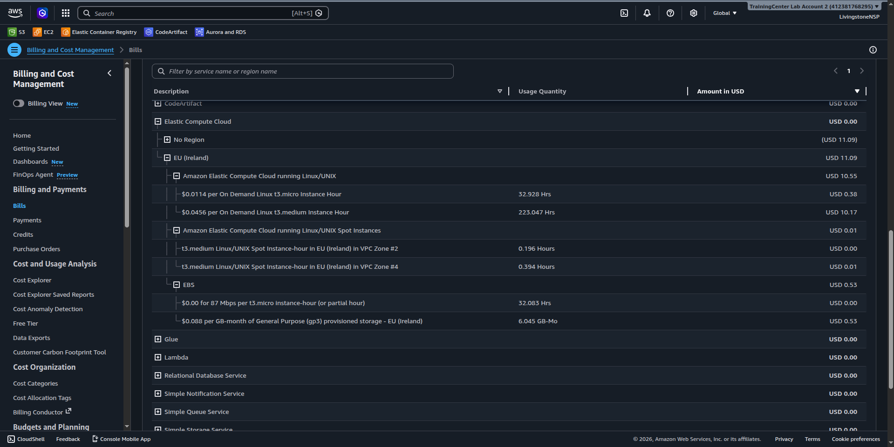

> The dominant cost is **On-Demand t3.medium hours** (the idle zombie + the ASG base). The Spot hours cost effectively nothing — exactly the saving Part 3 is built to capture.

> **Trusted Advisor** note: the account is on the free support tier, which limits the cost-optimisation checks (idle EC2 / unassociated EIP detection require Business or Enterprise support). The garbage collector below fills that gap programmatically.

### Automated garbage collector (`modules/cleanup`)

A Python 3.12 Lambda runs every Sunday at 23:59 UTC (EventBridge) and **sweeps every enabled region**.

| Target | Detection logic | Action |
|---|---|---|
| EBS volumes | `state == available` | `DeleteVolume` |
| Elastic IPs | `AssociationId` absent | `ReleaseAddress` |
| EC2 instances | **tagged `Type=ZombieAsset`** AND age ≥ 7 days AND avg CPU < 5% over 7 days | `TerminateInstances` |

**Safety design (defense in depth):** termination requires the `Type=ZombieAsset` tag, enforced in **both** the Lambda code *and* its IAM policy (`ec2:TerminateInstances` is conditioned on `ec2:ResourceTag/Type = ZombieAsset`). Instances younger than the 7-day window are also skipped. A logic regression still cannot terminate an untagged production instance.

**Live invocation** — both safety gates firing, and graceful multi-region handling:

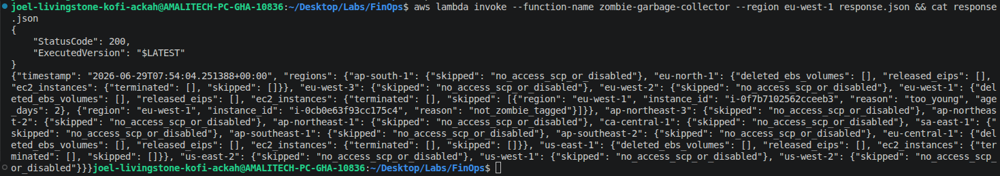

```jsonc
"eu-west-1": {
  "ec2_instances": { "terminated": [], "skipped": [
    { "instance_id": "i-0f7b7102562cceeb3", "reason": "too_young", "age_days": 2 },   // zombie EC2 spared
    { "instance_id": "i-0cb0e63f93cc175c4", "reason": "not_zombie_tagged" }           // ASG instance spared
  ]}
},
"ap-south-1": { "skipped": "no_access_scp_or_disabled" }   // org SCP denies EC2 here — handled, not crashed
```

The unattached EBS volume and unassociated EIP had already been reclaimed by the **scheduled Sunday run** (the deletion output is captured in [`docs/verification.md`](docs/verification.md)); this on-demand run confirms nothing is left to delete and that the safety gates protect everything still running.

**Run on demand:**
```bash
aws lambda invoke --function-name zombie-garbage-collector --region eu-west-1 response.json && cat response.json
```

Detection logic is covered by `pytest` unit tests — see [Testing](#testing).

---

## Part 2 — Governance (`modules/governance`)

### AWS Budget — $50/month with tiered alerts

Seven thresholds, all routed **through SNS only** (the SNS topic holds one confirmed email subscription, so each alert sends exactly one email — no duplicates).

| Threshold | Type |
|---|---|
| 50% / 70% / 80% / 90% / 100% | Actual |
| 80% / 100% | Forecasted |

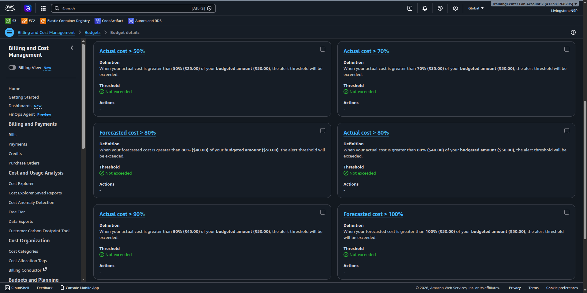

The SNS email subscription is **Confirmed**, so alerts will be delivered:

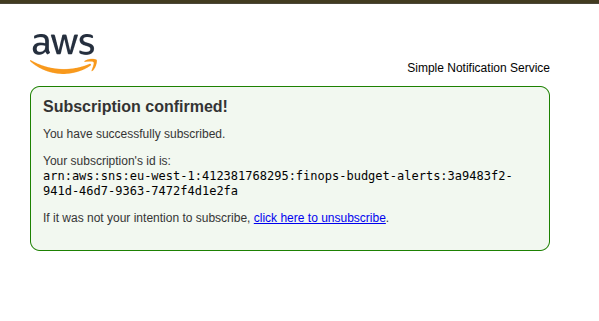

### CostCenter tagging policy — two enforcement layers

**Detective — AWS Config `REQUIRED_TAGS`** (`require-costcenter-tag-ec2`): continuously evaluates EC2 instances against the required `CostCenter` tag (`tag1Key=CostCenter`). The idle zombie `i-0f7b7102562cceeb3` is flagged **Noncompliant** because it has no `CostCenter` tag. Reactive — it does not block the launch.

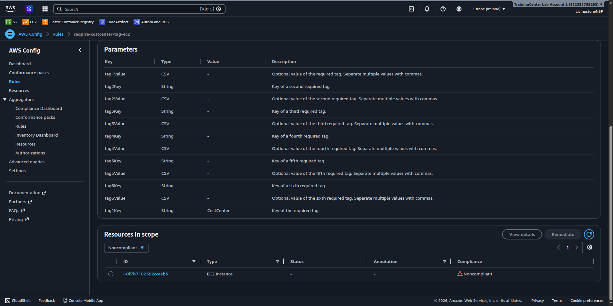

**Preventive — IAM Deny policy (SCP simulation):** `finops-deny-untagged-ec2`, attached to `finops-scp-test-user` alongside `AmazonEC2FullAccess`, blocks `ec2:RunInstances` when `CostCenter` is absent or empty — the same `UnauthorizedOperation` a real Organizations SCP produces. The portable SCP JSON is at [`modules/governance/documentation/policies/scp-deny-untagged.json`](modules/governance/documentation/policies/scp-deny-untagged.json).

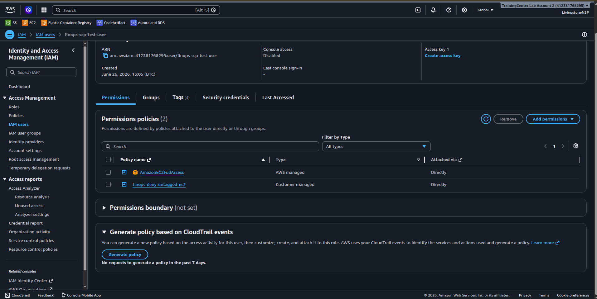

> **Access keys are not created by Terraform** (that would write the secret into state). Mint a short-lived key for the deny tests, then delete it:
> ```bash
> aws iam create-access-key --user-name finops-scp-test-user
> # ...run tests...
> aws iam delete-access-key --user-name finops-scp-test-user --access-key-id <id>
> ```

#### Tagging-policy test results (live)

| Test | Tags on `RunInstances` | Result |
|---|---|---|
| 1 | none | **DENIED** — `UnauthorizedOperation … explicit deny in identity-based policy: finops-deny-untagged-ec2` |
| 2 | `CostCenter=""` (empty) | **DENIED** — same explicit deny |
| 3 | `CostCenter=FinOps` | **ALLOWED** — instance launched, then terminated |

Full output is recorded in [`docs/verification.md`](docs/verification.md). Policy breakdown, attachment guidance, and break-glass procedures: [`modules/governance/documentation/policies/tagging-policy.md`](modules/governance/documentation/policies/tagging-policy.md).

---

## Part 3 — Optimization Architecture (`modules/optimize`)

### Mixed-Instances Auto Scaling Group

A guaranteed On-Demand base plus Spot for all scale-out, targeting stateless, interruption-tolerant workloads.

| Role | Instance type | Purchase |
|---|---|---|
| Base | t3.medium | On-Demand (1 always running) |
| Scale-out | t3.large | Spot (capacity-optimized) |
| Scale-out fallback | t3a.large | Spot (second pool) |

The ASG `finops-mixed-instances-asg` is live (min 1 / desired 1–3 / max 5) on launch template `lt-0be2aa6936fdffcee` across three AZs:

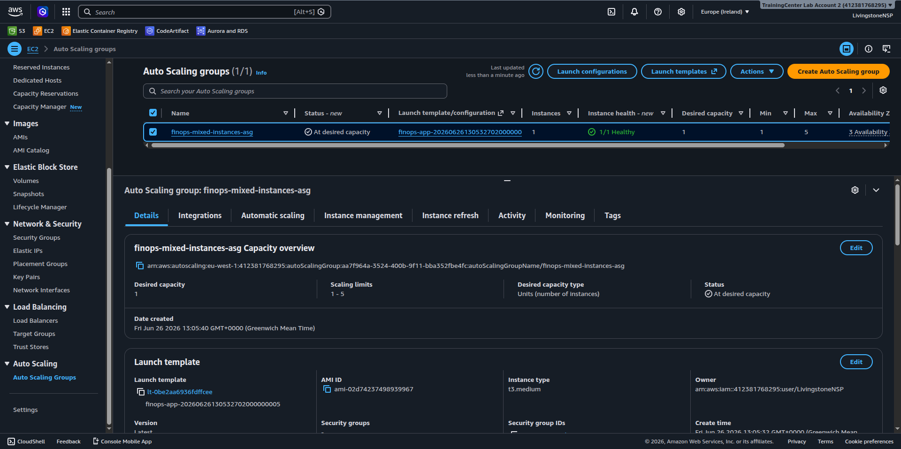

**Instance purchase options & allocation strategies** — `0% On-Demand / 100% Spot` above a base of 1 On-Demand, On-Demand allocation **Prioritized**, Spot allocation **Capacity optimized** (picks the highest-capacity pool to minimise interruptions):

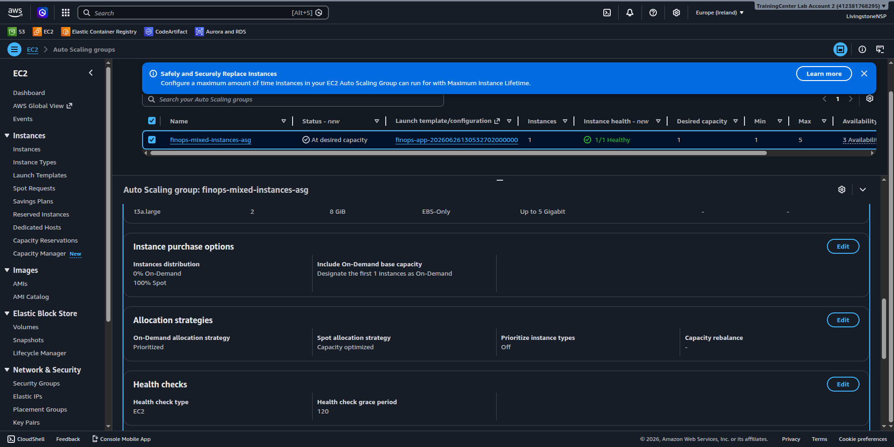

The Instance management tab shows the running, healthy instance(s); CPU-based alarms scale the group out at >70% (2 min) and in at <20% (3 min, longer cooldown to avoid thrashing):

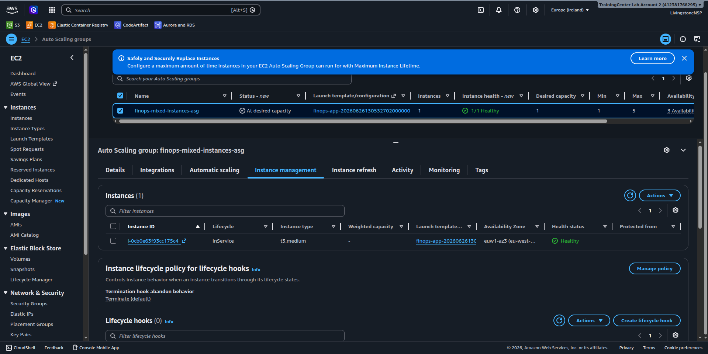

**Cost comparison (eu-west-1, 3 instances 24/7):** 3× t3.medium On-Demand ≈ **$90/mo** vs 1× On-Demand + 2× Spot ≈ **$50/mo** → **~44% saving**. The Bills evidence in Part 1 ([image13](Assets/image13.png)) confirms Spot instance-hours were actually consumed at near-zero cost.

**Verify the live On-Demand vs Spot mix:**
```bash
aws ec2 describe-instances --region eu-west-1 \
  --filters Name=tag:aws:autoscaling:groupName,Values=finops-mixed-instances-asg \
            Name=instance-state-name,Values=running \
  --query 'Reservations[].Instances[].{ID:InstanceId,Type:InstanceType,Lifecycle:InstanceLifecycle,AZ:Placement.AvailabilityZone}' \
  --output table
```

End-to-end guide: [`modules/optimize/documentation/cost-optimization-guide.md`](modules/optimize/documentation/cost-optimization-guide.md).

---

## Testing

The garbage collector's logic (idle detection, age guard, tag gate, multi-region discovery, EBS/EIP selection) is covered by **13 `pytest` unit tests** using mocked boto3 clients — no AWS calls, no credentials.

```bash
python3 -m venv .venv && source .venv/bin/activate
pip install -r tests/requirements.txt
pytest -v        # 13 passed
```

The same suite plus `terraform fmt -check` and `terraform validate` run on every push/PR via [`.github/workflows/ci.yml`](.github/workflows/ci.yml).

---

## How the first-round feedback was addressed

| Review gap | Fix |
|---|---|
| No remote backend; 4 local state files | Single S3 backend (`backend.tf`) with native lockfile; bootstrap script |
| 4 separate root modules | One root composing 4 child modules under `modules/` |
| Lambda `TerminateInstances` on `Resource="*"` | Conditioned on `ec2:ResourceTag/Type=ZombieAsset` (IAM **and** code) |
| Duplicate budget emails (SNS + direct) | Removed `subscriber_email_addresses`; SNS-only delivery |
| Access key secret in state | `aws_iam_access_key` removed; keys minted out-of-band |
| Single-region garbage collector | Iterates all enabled regions via `describe_regions` |
| `*.zip` committed | `.gitignore`d and removed (`archive_file` regenerates it); lock file now committed |
| Testing 2/5 | 13-test pytest suite + GitHub Actions CI |

---

## Requirements

- Terraform >= 1.11.0 (S3 backend native locking), AWS provider 6.25.0
- AWS CLI configured (`AWS_PROFILE=NSPAccount`) with EC2, Lambda, Budgets, Config, SNS, CloudWatch, IAM, S3 permissions
- Python 3.12 (Lambda runtime; boto3 + pytest only needed locally to run tests)
